# Taozi Tree Business Performance Analysis: Unlocking Growth Opportunities

## Executive Summary

This report provides a comprehensive analysis of Taozi Tree's class data from June 2024 to July 2025. It identifies key performance indicators, uncovers temporal trends, evaluates the performance of individual classes, assesses teacher contributions, and investigates the significant impact of scheduling (day and time) and teacher tenure on business outcomes. The findings offer actionable insights for optimizing class offerings, teacher deployment, and scheduling strategies to enhance profitability and student engagement.

---

### How to Navigate This Repository

This repository contains the full analysis of Taozi Tree's class performance.
* **`TaoziTree_Analysis_Notebook.ipynb`**: This is the Google Colab notebook containing all the Python code for data loading, cleaning, analysis, and plot generation.
* **`Classes (as of 3 July 2025) - For Dragos.csv`**: The original raw data file.
* **`cleaned_classes_data.csv`**: The cleaned and preprocessed dataset used for analysis.
* **`images/`**: This directory contains all the generated visualization files (`.png` format) referenced throughout this `README.md` report.

---

## 1. Overall Business Performance: Key Metrics

Taozi Tree demonstrates a strong financial foundation and operational scale.

* **Total Revenue (June 2024 - July 2025):** $610,686.24
* **Total Profit/Loss (June 2024 - July 2025):** $5,327,595.00
    * **Important Clarification on Profit/Loss:** It is critical to note that the sum of 'Profit/Loss Per Class' ($5.3M) is significantly higher than the 'Total Revenue' ($0.61M). This indicates that the 'Profit/Loss Per Class' metric in the source data likely represents a **'Contribution Margin' or 'Gross Profit per Class'**, rather than the final net profit. This value would be calculated *before* deducting larger operational overheads (e.g., rent, utilities, general marketing) which are accounted for at a higher aggregate level. Owners should verify the precise definition and calculation methodology of this metric with their accounting team to ensure accurate financial interpretation.
* **Average Paying Students per Class (Overall):** 5.35 students
* **Average Total Students per Class (Overall):** 6.85 students
* **Average Revenue per Paid Student (Overall):** $81.32

Taozi Tree operates with 53 unique class types, taught by 52 different teachers across 7 venues.

---

## 2. Temporal Performance Trends

Analyzing monthly data reveals fluctuations that indicate seasonal patterns or the impact of strategic decisions.

* **Monthly Revenue and Profit/Loss Trends:** The plot below illustrates the monthly financial performance. Noticeable dips occur in periods like July-September 2024 and January 2025, while strong growth and high profitability are observed from February to July 2025.

    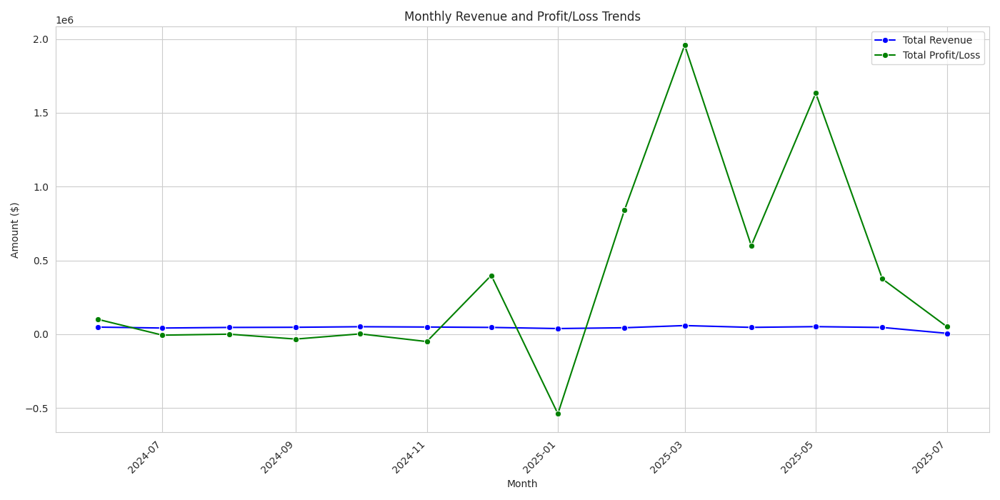

* **Monthly Paying Students Trend:** This plot shows how student attendance fluctuates monthly, generally mirroring the financial trends.

    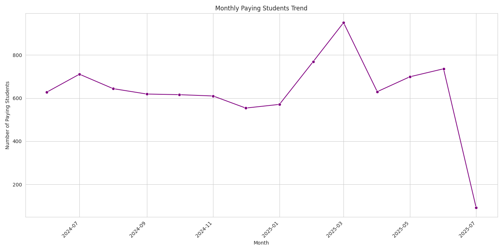

---

## 3. Class Performance Deep Dive

Understanding which classes are most popular and profitable is essential for optimizing offerings.

* **Top 10 Most Profitable Classes:**
    * `LUNCHTIME POWER FLOW | 中午力量流` is the most profitable class.
    * `BEGINNER'S VINYASA | 初级流瑜伽` and `ELEMENTAL FLOW | 自然元素流` are also top contributors.
    * `LIL’ PEACHES KIDS` classes demonstrate exceptional profit efficiency per student.

    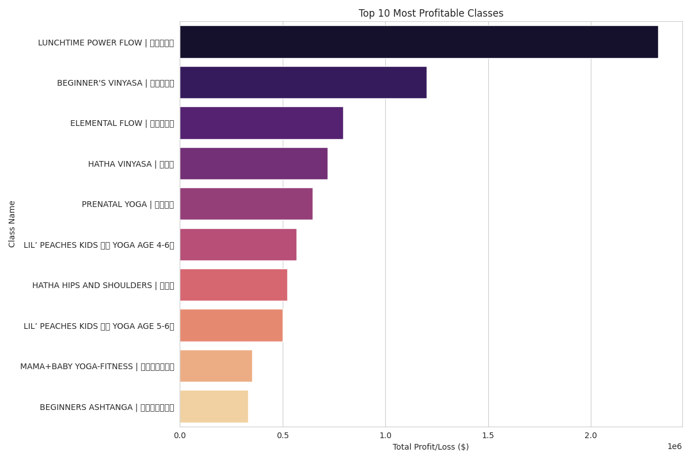

* **Top 10 Least Profitable / Loss-Making Classes:**
    * Classes like `ASHTANGA PRIMARY SERIES | 阿斯汤伽瑜伽`, `VINYASA L1/2 | 流瑜伽1/2级`, and `VINYASA LEVEL 2 | 瑜伽流 2级` consistently show lower profitability or incur losses. This also includes several new/specialized `✨` classes.

    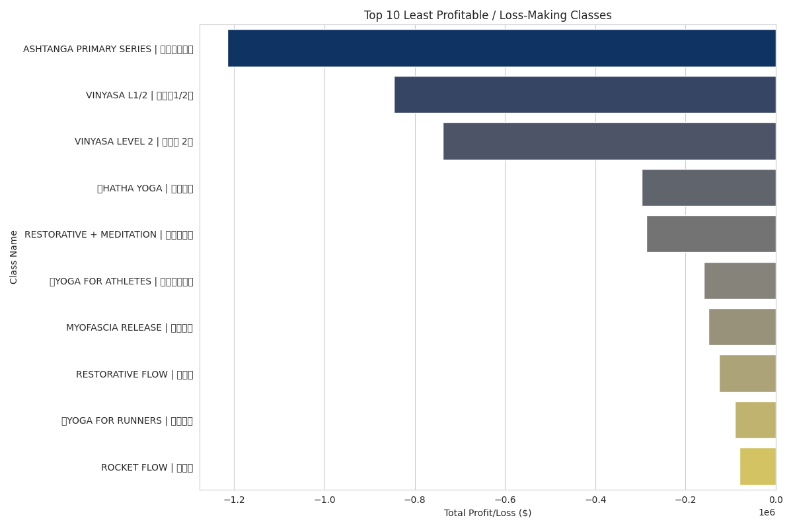

* **Top 10 Most Popular Classes by Average Paying Students:**
    * `LUNCHTIME POWER FLOW | 中午力量流` also leads in average students per class.
    * Other strong performers include `BEGINNER'S VINYASA | 初级流瑜伽` and `ELEMENTAL FLOW | 自然元素流`.

    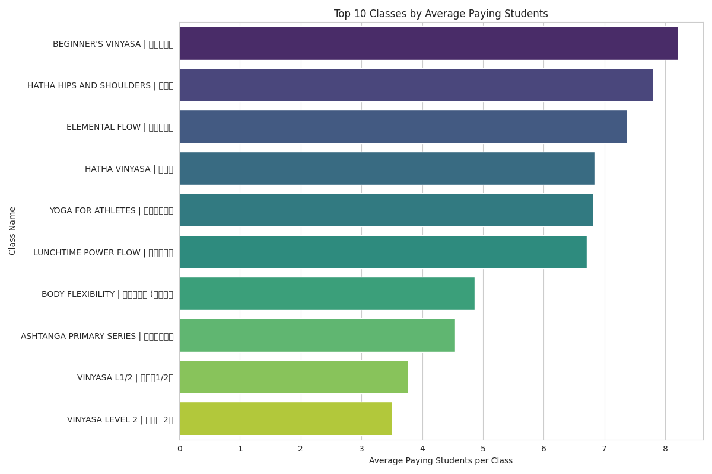

---

## 4. Teacher Performance Analysis

Teachers are central to student experience and business success. This analysis highlights their contributions.

* **Top Teachers by Average Profit/Loss per Class:**
    * **Alessandra (EN | IT):** Highest average profit/loss per class (~ $47,911)
    * **Monica - 晨芳雪 (EN):** (~ $17,615/class)
    * **Gina (EN | 中文):** (~ $16,516/class)
    * **Theresa 桃子老师 (EN | 中文):** (~ $14,949/class)
    * **Marie (EN | DE):** (~ $6,633/class)

    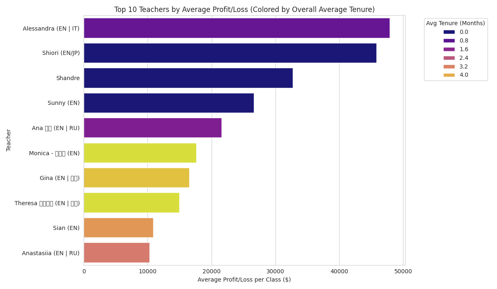

* **Top Teachers by Average Paying Students per Class:**
    * **Theresa 桃子老师 (EN | 中文):** (~8.47 students/class) leads in attracting students per class.
    * **Alessandra (EN | IT):** (~7.12 students/class)
    * **Monica - 晨芳雪 (EN):** (~7.16 students/class)

    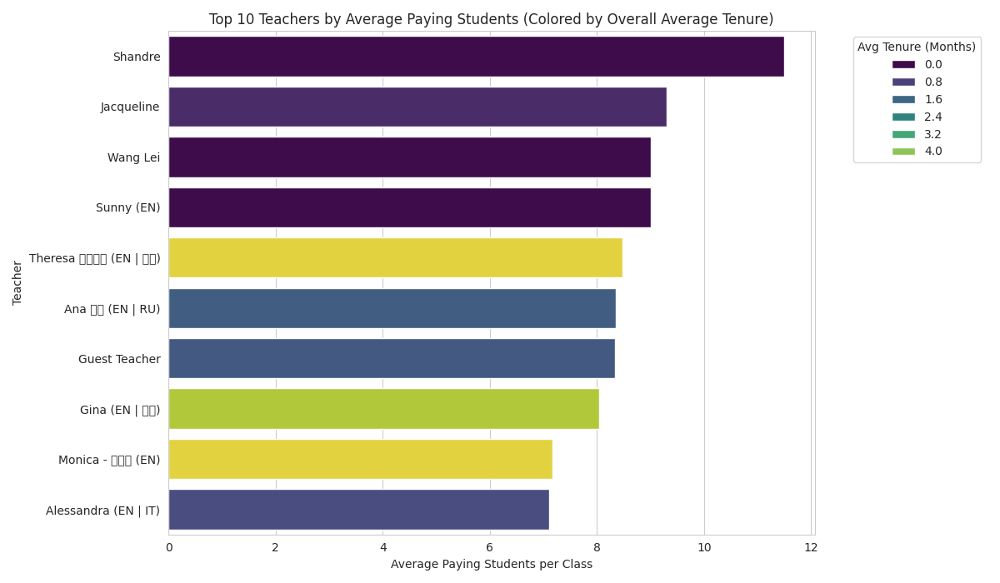

---

## 5. The Power of Teacher-Class Tenure

Our analysis confirms the hypothesis: a teacher's consistency with a specific class directly correlates with improved class performance.

* **Student Growth with Tenure:** The plot below shows that average paying students per class generally increase as a teacher's tenure with that specific class grows. Students develop loyalty and trust with consistent instructors.

    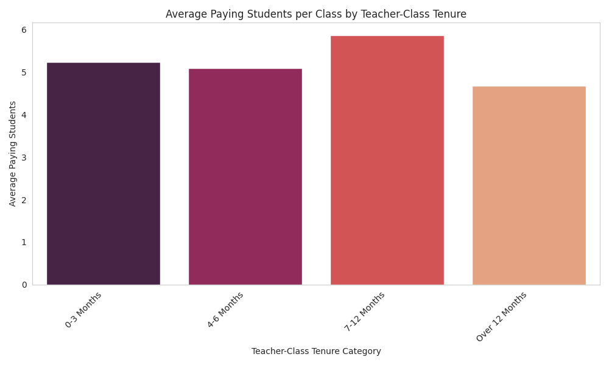

* **Profitability Growth with Tenure:** Similarly, average profit/loss per class tends to improve significantly with increasing teacher-class tenure. This is a direct result of higher attendance.

    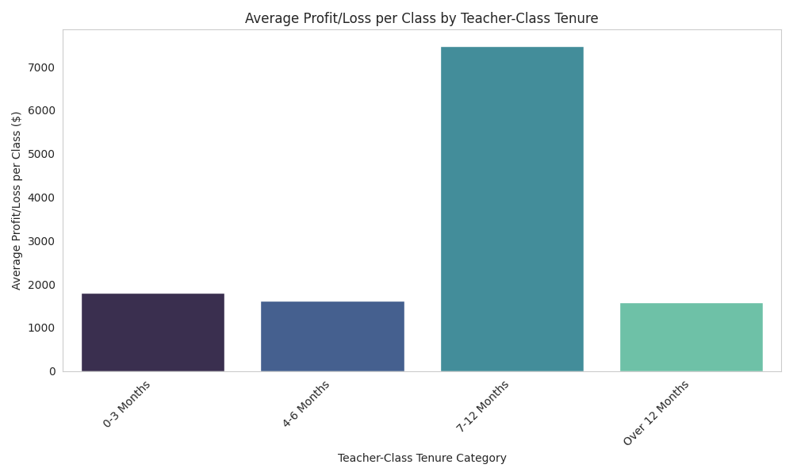

---

## 6. Scheduling Optimization: Day and Time Impact

The day of the week and the exact time of a class significantly influence its popularity and profitability.

* **Average Paying Students by Day of Week:** Weekend days (Saturday, Sunday) consistently have the highest average attendance.

    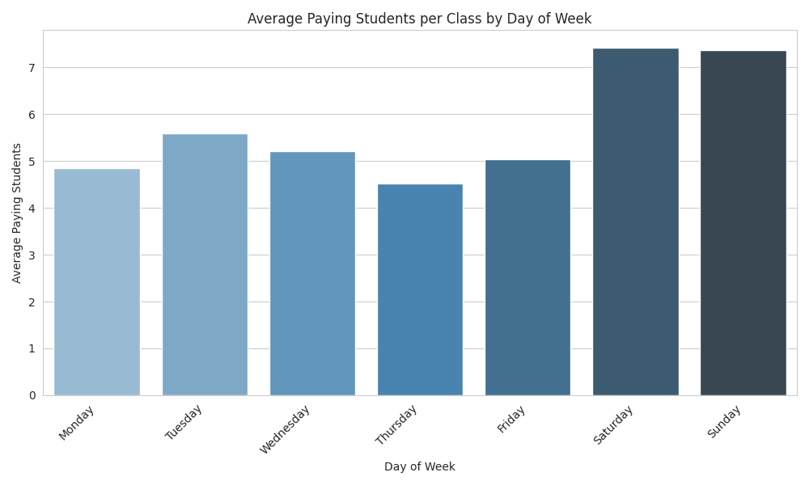

* **Average Profit/Loss per Class by Day of Week:** Weekends and Tuesdays are generally the most profitable days per class.

    

* **Average Paying Students by Time Category:** Evening (18:00-23:59) and Lunchtime (12:00-14:59) slots attract the most students.

    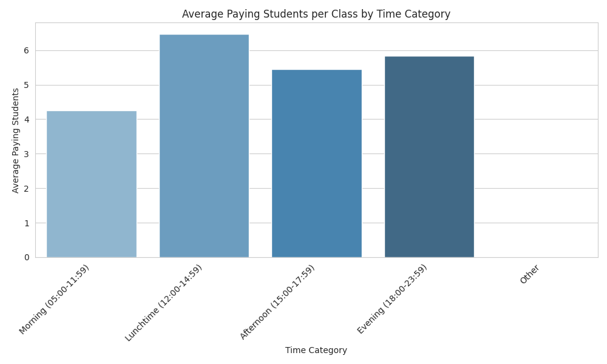

* **Average Profit/Loss per Class by Time Category:** Evening and Lunchtime slots are also the most profitable.

    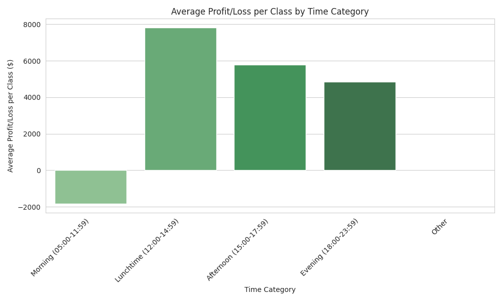

* **Performance Hotspots (Day & Time Heatmaps):** The heatmaps below provide a granular view:
    * **High Attendance & Profit:** Weekend lunch and evening slots are prime times. Weekday evening and lunchtime classes also perform well.

    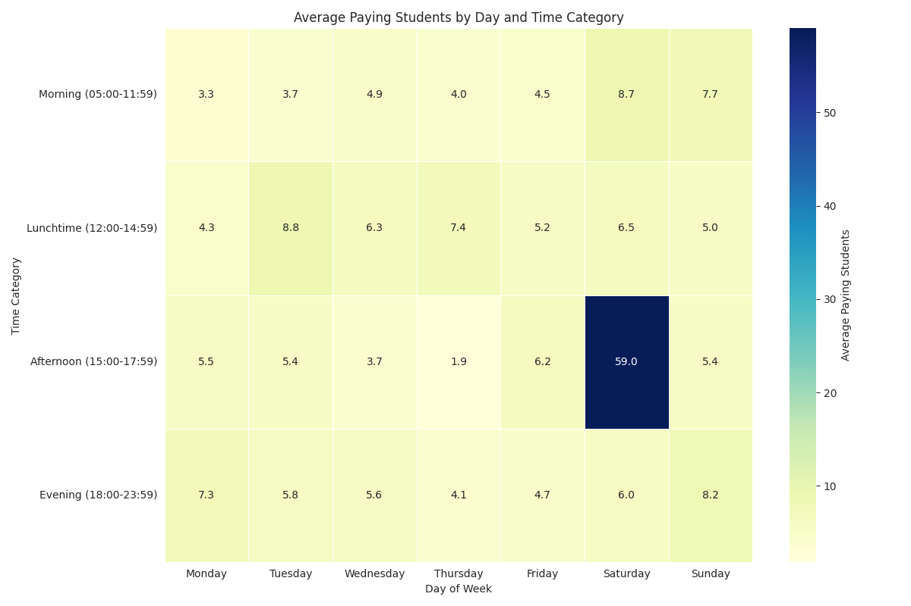

    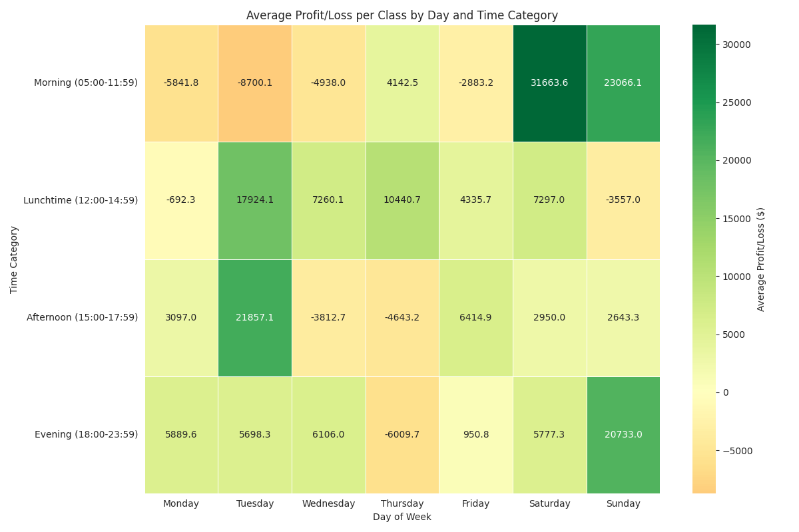

---

## 7. Venue Performance Analysis

Understanding performance across different locations is vital for resource allocation.

* **Total Paying Students by Venue:** `SANLITUN 三里屯` is the primary venue by student volume, followed by `JINSHANG 金尚·源`.

    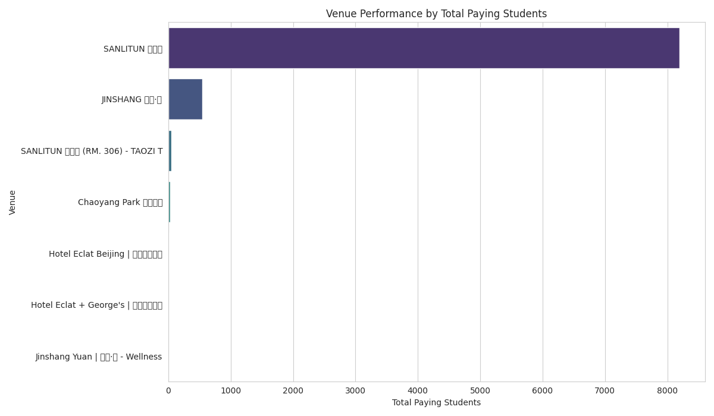

* **Total Profit/Loss by Venue:** `SANLITUN 三里屯` contributes the most to overall profit. Notably, smaller/niche venues like `SANLITUN 三里屯 (RM. 306) - TAOZI T`, `Chaoyang Park 朝阳公园`, and `Hotel Eclat Beijing | 北京怡亨酒店` show exceptionally high average profit per class, despite fewer classes.

    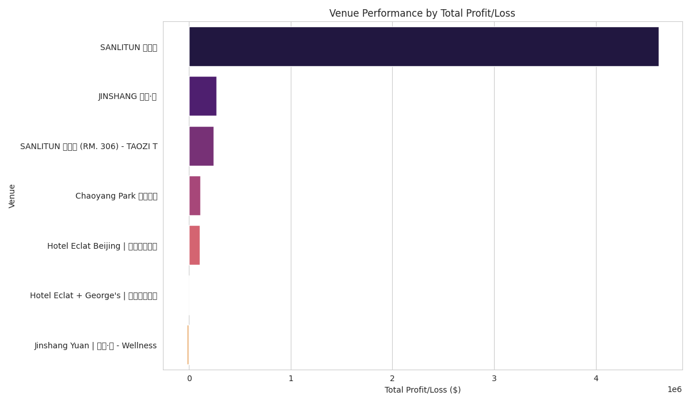

---

## Final Actionable Recommendations for Taozi Tree

Based on this comprehensive analysis, here are key strategies to drive further growth and profitability:

1.  **Strategic Class Portfolio Management:**
    * **Expand Winners:** Increase the frequency and capacity of top-performing classes (e.g., `LUNCHTIME POWER FLOW`, `BEGINNER'S VINYASA`, `LIL’ PEACHES KIDS` series). These are your proven revenue generators.
    * **Re-evaluate Underperformers:** Conduct in-depth reviews of consistently loss-making classes (`ASHTANGA PRIMARY SERIES`, `VINYASA L1/2`, `VINYASA LEVEL 2`). Consider price adjustments, targeted marketing, teacher changes, schedule modifications, or potential discontinuation if improvements aren't viable.
2.  **Optimize Scheduling for Maximum Impact:**
    * **Prioritize Peak Times:** Schedule top classes and teachers for **weekend (Lunchtime & Evening)** and **weekday (Lunchtime & Evening)** slots. These are your high-demand periods.
    * **Innovate Off-Peak:** For weekday mornings and afternoons, explore niche classes, special pricing, or alternative uses (e.g., workshops, private sessions, teacher training) that might better suit the limited demand in those timeframes.
3.  **Invest in Teacher Consistency and Development:**
    * **Foster Tenure:** Actively encourage and support teachers in building long-term tenure within specific class types. This directly translates to increased student loyalty and class profitability.
    * **Nurture Talent:** Continue to recognize and reward high-performing teachers (e.g., Alessandra, Monica, Gina, Theresa). Provide targeted support and development plans for teachers whose classes consistently underperform, potentially exploring different class assignments.
4.  **Strategic Venue Utilization:**
    * **Core Focus:** Continue to leverage `SANLITUN 三里屯` as the primary hub for diverse offerings.
    * **Niche Expansion:** Capitalize on the high per-class profitability observed at external venues like `Chaoyang Park 朝阳公园` and `Hotel Eclat Beijing | 北京怡亨酒店`. Consider offering more specialized workshops or premium, exclusive classes at these locations.
5.  **Continuous Data-Driven Decision Making:**
    * Establish a routine for reviewing these key performance metrics and trends monthly. This agile approach will allow for quick adjustments to schedules, marketing, and offerings, ensuring the business remains responsive and optimized.
