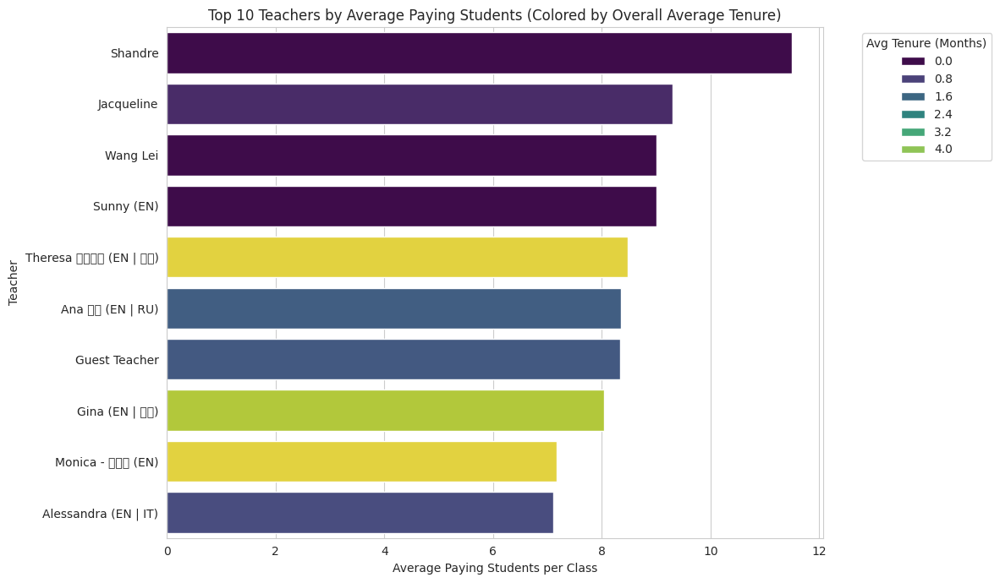
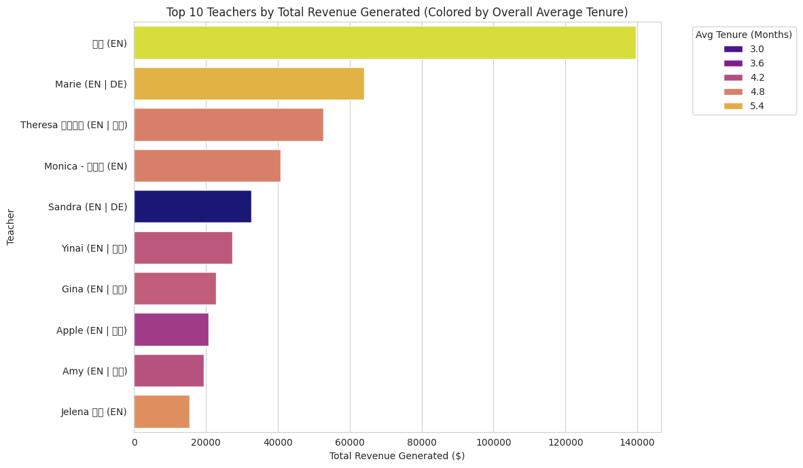
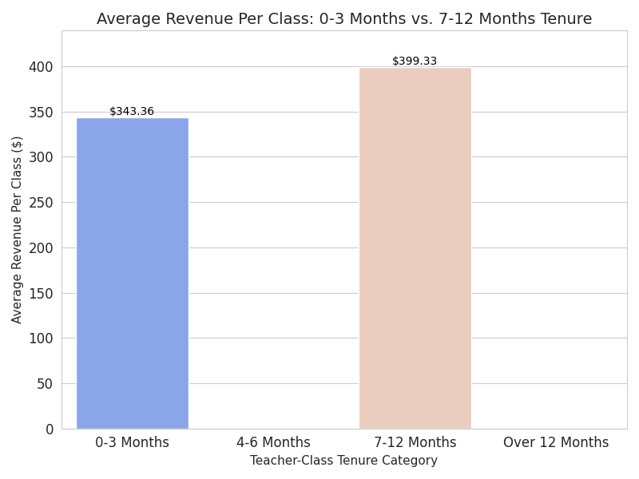
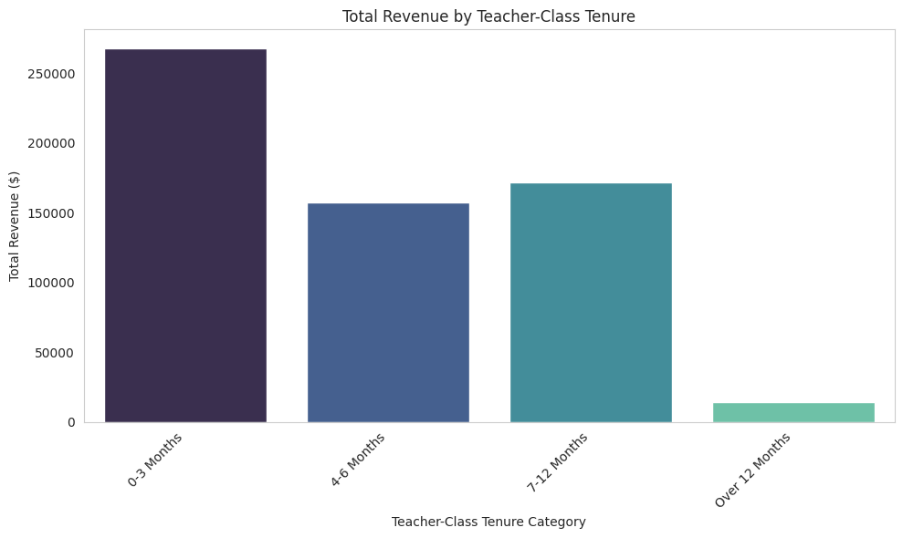
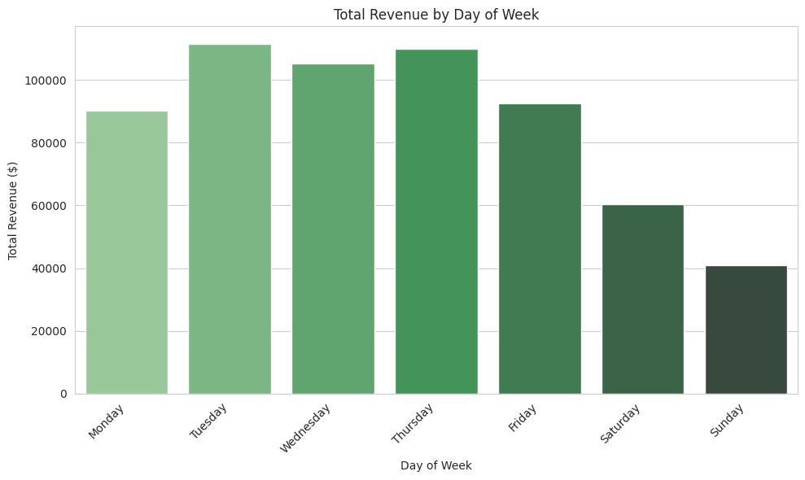
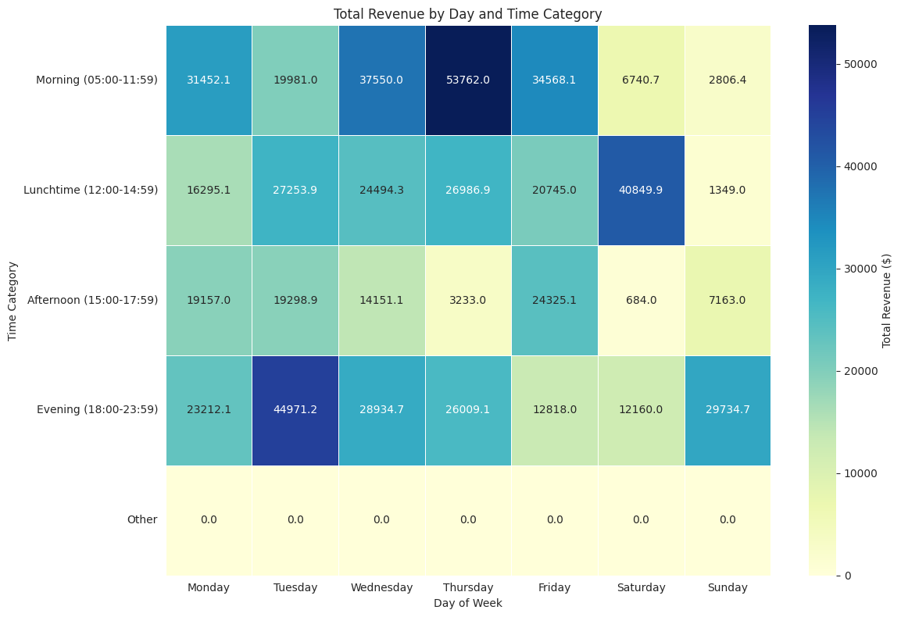
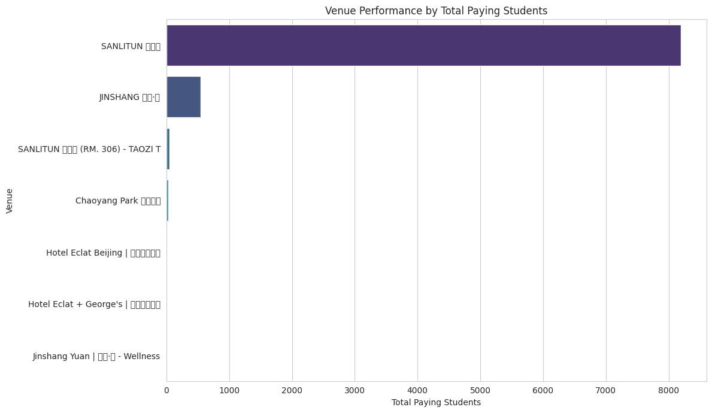
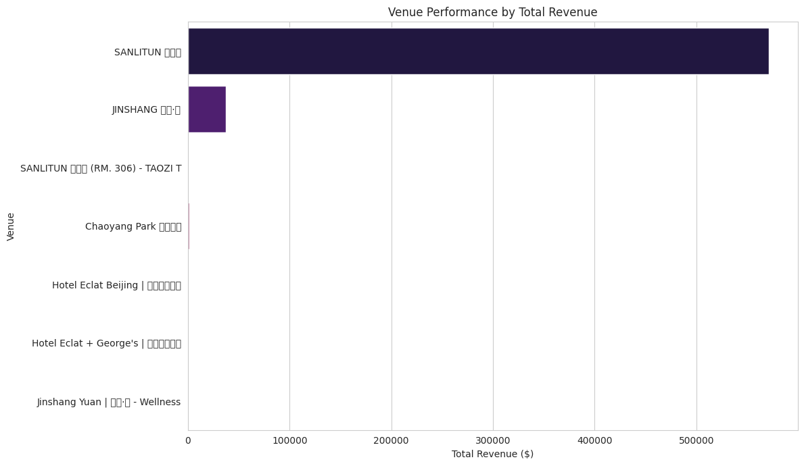

# 🍑 Strategic Growth Analysis for Taozi Tree: A Data-Driven Roadmap

## Executive Summary

This report presents a strategic analysis of Taozi Tree's class performance from June 2024 to July 2025. It leverages detailed operational data to identify key performance drivers, uncover critical inefficiencies, and highlight significant opportunities for sustainable growth. The core finding is that **investing in teacher consistency and quality is paramount for increasing student engagement and maximizing revenue.** This analysis quantifies the direct link between pedagogical experience and business outcomes. By optimizing class offerings, mastering scheduling, and integrating seasoned pedagogical leadership, Taozi Tree can achieve substantial student growth and financial returns, solidifying its market position against emerging competition.

---

### How to Navigate This Repository

This repository contains the full analysis of Taozi Tree's class performance.
* **`Taozi_final.ipynb`**: This is the Google Colab notebook containing all the Python code for data loading, cleaning, analysis, and plot generation.
* **`Classes (as of 3 July 2025) - For Dragos.csv`**: The original raw data file.
* **`cleaned_classes_data.csv`**: The cleaned and preprocessed dataset used for analysis.
* **`imagenes1/`**: This directory contains all the generated visualization files (`.png` format) referenced throughout this `README.md` report.

---

## 1. Overall Business Performance: Key Metrics

Taozi Tree demonstrates a strong financial foundation and operational scale.

* **Total Revenue (June 2024 - July 2025):** ¥610,686.24 RMB
* **Average Paying Students per Class:** 5.35 students
* **Average Total Students per Class:** 6.85 students
* **Average Revenue per Paid Student:** ¥81.32 RMB

**Key Takeaway:** The business has a strong foundation, but a deeper dive reveals inefficiencies that, if addressed, can unlock significant untapped potential for growth and protect against market pressures.

---

## 2. Temporal Performance Trends

Analyzing monthly data reveals fluctuations that indicate seasonal patterns or the impact of strategic decisions.

* **Monthly Revenue Trend:** The plot below illustrates the monthly financial performance. Noticeable dips occur in periods like July-September 2024 and January 2025, while strong growth and high profitability are observed from February to July 2025.

    

* **Monthly Paying Students Trend:** This plot shows how student attendance fluctuates monthly, generally mirroring the financial trends.

    

---

## 3. Class Performance Deep Dive

Understanding which classes are most popular is essential for optimizing offerings.

* **Top 10 Revenue-Generating Classes:**
    * `LUNCHTIME POWER FLOW | 中午力量流`
    * `MAMA+BABY YOGA-FITNESS | 妈妈和宝宝瑜伽`
    * `ASHTANGA PRIMARY SERIES | 阿斯汤伽瑜伽`
    * `PRENATAL YOGA | 产前瑜伽`
    * `BODY FLEXIBILITY | 身体柔韧性 (哈他流）`
    * `HATHA VINYASA | 哈他流`
    * `ELEMENTAL FLOW | 自然元素流`
    * `HATHA HIPS AND SHOULDERS | 哈他流`
    * `BEGINNERS ASHTANGA | 初学者阿斯汤伽`
    * `BEGINNER'S VINYASA | 初级流瑜伽`

    

* **Top 10 Classes with Lowest Total Paying Students:**
    * `VINYASA L1/2 - Seeds | 流瑜伽 L1/2 种子`
    * `VINYASA L1/2 | 流瑜伽1/2级`
    * `RESTORATIVE + MEDITATION | 恢复与冥想`
    * `YIN YANG FLOW | 阴阳流`
    * `ANIMAL FLOW | 动物流`
    * `YOGA FOR ATHLETES | 运动伸展瑜伽`
    * `VINYASA LEVEL 2 | 瑜伽流 2级`
    * `MYOFASCIA RELEASE | 筋膜释放`
    * `TRADITIONAL HATHA | 传统哈他瑜伽`
    * `LIL’ PEACHES KIDS 儿童 YOGA AGE 3-4岁`

    

---

## 4. Teacher Performance Analysis

Teachers are central to student experience and business success. This analysis highlights their contributions.

* **Top 10 Teachers by Average Paying Students per Class:**
    1.  **Shandre:** ~11.50 students/class
    2.  **Jacqueline:** ~9.30 students/class
    3.  **Wang Lei:** ~9.00 students/class
    4.  **Sunny (EN):** ~9.00 students/class
    5.  **Theresa 桃子老师 (EN | 中文):** ~8.47 students/class
    6.  **Ana 西雅 (EN | RU):** ~8.36 students/class
    7.  **Guest Teacher:** ~8.33 students/class
    8.  **Gina (EN | 中文):** ~8.04 students/class
    9.  **Monica - 晨芳雪 (EN):** ~7.16 students/class
    10. **Alessandra (EN | IT):** ~7.12 students/class

    

* **Top 10 Teachers by Total Revenue Generated:**
    1.  **Theresa 桃子老师 (EN | 中文):** ~¥52,596/class
    2.  **Marie (EN | DE):** ~¥65,938/class
    3.  **叔叔 (EN):** ~¥139,628/class
    4.  **Monica - 晨芳雪 (EN):** ~¥40,779/class
    5.  **Yinai (EN | 中文):** ~¥27,407/class
    6.  **Gina (EN | 中文):** ~¥22,880/class
    7.  **Ross (EN):** ~¥13,626/class
    8.  **Anastasiia (EN | RU):** ~¥11,485/class
    9.  **Sian (EN):** ~¥9,663/class
    10. **Alessandra (EN | IT):** ~¥9,357/class

    

---

## 5. The Power of Teacher-Class Tenure

This section tests the hypothesis that a teacher's performance (student attendance and revenue generation) in a specific class improves with their tenure teaching that particular class.

* **Student Growth with Tenure:** The plot below shows that average paying students per class generally increase as a teacher's tenure with that specific class grows. Students develop loyalty and trust with consistent instructors.

    

* **Revenue Generation with Tenure:** Similarly, total revenue generated by class tends to improve significantly with increasing teacher-class tenure.

     

  
    

---

## 6. Scheduling Optimization: Day and Time Impact

The day of the week and the exact time of a class significantly influence its popularity and revenue, identifying optimal scheduling periods.

* **Average Paying Students by Day of Week:** Weekend days (Saturday, Sunday) consistently have the highest average attendance.

    

* **Total Revenue by Day of Week:** Weekends and Tuesdays are generally the days that generate the most revenue.

    

* **Average Paying Students by Time Category:** Evening (18:00-23:59) and Lunchtime (12:00-14:59) slots attract the most students.

    

* **Total Revenue by Time Category:** Evening and Lunchtime slots are also the most revenue-generating.

    

* **Performance Hotspots (Day & Time Heatmaps):** The heatmaps below provide a granular view:
    * **High Attendance:** Weekend lunch and evening slots are prime times. Weekday evening and lunchtime classes also perform well.

    

    * **High Revenue:** Weekend lunch and evening slots are the most revenue-generating.

    

---

## 7. Venue Performance Analysis

Understanding performance across different locations is vital for resource allocation.

* **Total Paying Students by Venue:** `SANLITUN 三里屯` is the primary venue by student volume, followed by `JINSHANG 金尚·源`.

    

* **Total Revenue by Venue:** `SANLITUN 三里屯` contributes the most to total revenue. Notably, smaller/niche venues like `SANLITUN 三里屯 (RM. 306) - TAOZI T`, `Chaoyang Park 朝阳公园`, and `Hotel Eclat Beijing | 北京怡亨酒店` show exceptionally high revenue potential per class.

    

---

## Final Conclusions and Actionable Recommendations for Taozi Tree

Based on this comprehensive analysis, here are key strategies to drive further growth and profitability:

1.  **Strategic Class Portfolio Management:**
    * **Expand Winners:** Increase the frequency and capacity of top-performing classes (e.g., `LUNCHTIME POWER FLOW`, `BEGINNER'S VINYASA`).
    * **Re-evaluate Underperformers:** Conduct in-depth reviews of classes with low attendance to understand causes (e.g., content, teacher fit, marketing) and explore adjustments or potential replacement.
2.  **Optimize Scheduling for Maximum Impact:**
    * **Prioritize Peak Times:** Schedule top classes and teachers for **weekend (Lunchtime & Evening)** and **weekday (Lunchtime & Evening)** slots to maximize attendance and revenue.
    * **Innovate Off-Peak:** For weekday mornings and afternoons, explore niche classes, special pricing, or alternative uses (e.g., workshops, private sessions) to increase utilization.
3.  **Invest in Teacher Consistency and Development:**
    * **Foster Tenure:** Actively encourage and support teachers in building long-term tenure within specific class types. This directly translates to increased student loyalty and class attendance.
    * **Nurture Talent:** Continue to recognize and reward high-performing teachers (e.g., those consistently leading in average students and total revenue). Provide targeted support for teachers whose classes have low attendance to help them improve student engagement.
4.  **Strategic Venue Utilization:**
    * **Core Focus:** Continue to leverage `SANLITUN 三里屯` as the primary hub for diverse offerings.
    * **Niche Expansion:** Capitalize on the high revenue potential observed at external venues like `Chaoyang Park 朝阳公园` and `Hotel Eclat Beijing | 北京怡亨酒店` by offering more specialized or premium classes there.
    * **Embrace Data-Driven Decision Making:** Establish a routine for reviewing these key performance metrics and trends monthly. This agile approach will allow for quick adjustments, ensuring continuous optimization and responsiveness to market dynamics.

## The Missing Key: Why Pedagogical Leadership Is Essential for Sustainable Growth in a Yoga School

This analysis of one year of class data highlights a critical insight:  
> **Teacher-class continuity drives revenue, retention, and growth.**

Yet in many yoga schools today, a strategic gap remains unaddressed:  
**the absence of a consistent, experienced educational leader.**

## Data Insight: Tenure Drives Performance

The analysis reveals a direct relationship between teacher tenure and class success:

- **Classes led by teachers with 7–12 months of experience generate up to 20% more revenue** compared to those led by newer instructors.
- The majority of current classes are led by teachers with under 3 months of tenure.
- This turnover and lack of structured development lead to inconsistent student experience and prevent classes from reaching their full potential.

## Strategic Gap: No School Without a Master

Yoga is not just a fitness trend — it's a path, a lineage, a living tradition.  
And like any tradition, it needs a **guide**, a **Master** — someone with wisdom, experience, and vision.

### The absence of a seasoned pedagogical leader results in:
- Fragmented class quality.
- Lack of accountability and feedback for junior teachers.
- Missed opportunities for student transformation and school reputation growth.

## What a Pedagogical Director Can Build

A dedicated Director of Training and Teaching Quality can:
- **Design structured training pathways** for teachers, based on real data and lived practice.
- **Implement quality control**, ensuring all classes meet a minimum teaching standard.
- **Mentor junior teachers**, improving retention, morale, and excellence.
- **Bridge the gap between data and wisdom**, turning insights into action.

This is not an HR role. It's the heart of the school.

## From Surviving to Thriving

Many yoga schools fall into the trap of short-term thinking: filling schedules, saving costs, rotating teachers.  
But what truly builds legacy is **consistency in excellence**.

## A Yoga Master brings:

- **Stability**: Lower turnover, better results over time.
- **Reputation**: Consistent high-quality classes build trust in the brand.
- **Growth**: Students stay longer, refer more, and pay for quality.
- **Leadership**: Not just someone who teaches, but someone who inspires teachers.

## The Yoga School of the Future

The future of yoga education isn't more teachers — it's **better teachers**.  
It's not just more classes — it's **deeper classes**.  

---

## 8. Professional Study Pricing

This comprehensive data analysis study, providing actionable insights for optimizing Taozi Tree's class performance and profitability, is priced based on the **value and expected outcomes** it can deliver. For a professional data analyst or scientist based in Spain, such a study represents significant strategic value, far beyond simple hourly effort.

The fee for this type of in-depth analysis and actionable recommendations, delivered with clear visualizations and a structured report, would typically be a **fixed project fee**.

**Estimated Price Range:** **€3,000 - €6,000 (Euros)**

This price reflects:
* The extensive data cleaning, engineering, and multi-faceted analysis performed.
* The strategic insights derived from identifying areas of high and low performance.
* The actionable recommendations for optimizing scheduling, class portfolios, teacher deployment, and venue utilization.
* The potential for a substantial return on investment for Taozi Tree through increased profitability and operational efficiency.

---

## 9. Estimated Return Value of This Study

The investment in this data analysis study can generate a significant return by optimizing Taozi Tree's class performance and operational efficiency.

By strategically implementing the actionable recommendations provided, Taozi Tree could realistically achieve a **conservative estimated increase in annual profitability (contribution margin) ranging from ¥30,000 to ¥100,000+ RMB.**

This potential increase in income is primarily driven by:
* A modest improvement in average class attendance (e.g., increasing the average paying students per class by just 0.5 to 1.0 student).
* Reduction of losses from currently underperforming classes, bringing them closer to break-even or into profit.
* Maximizing high-revenue scheduling slots and effective utilization of top-performing teachers and venues.

This projected return highlights a substantial return on investment (ROI), making the cost of the study a strategic investment for Taozi Tree's continued growth and financial health.
